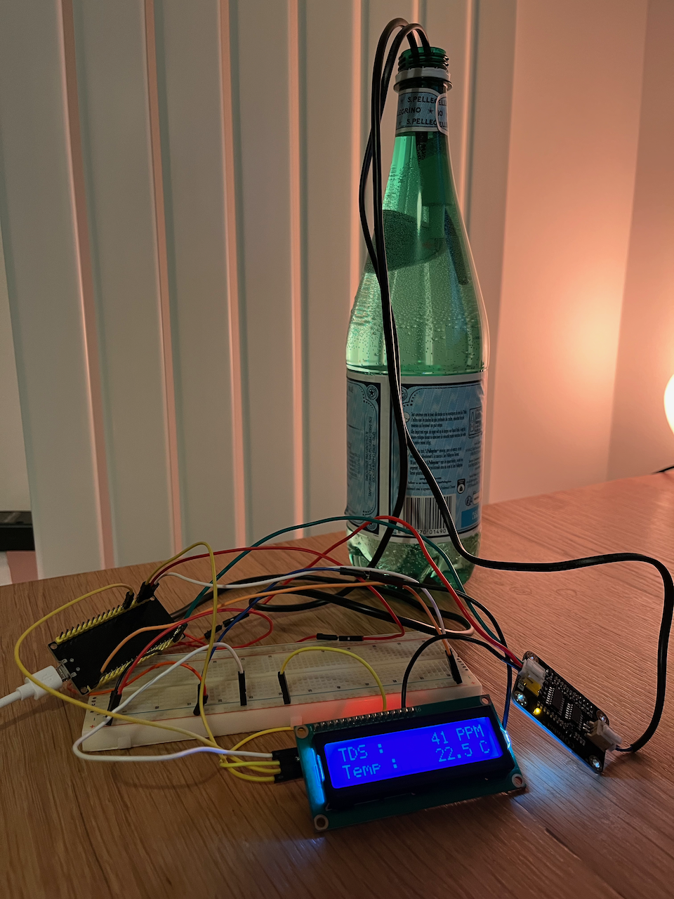
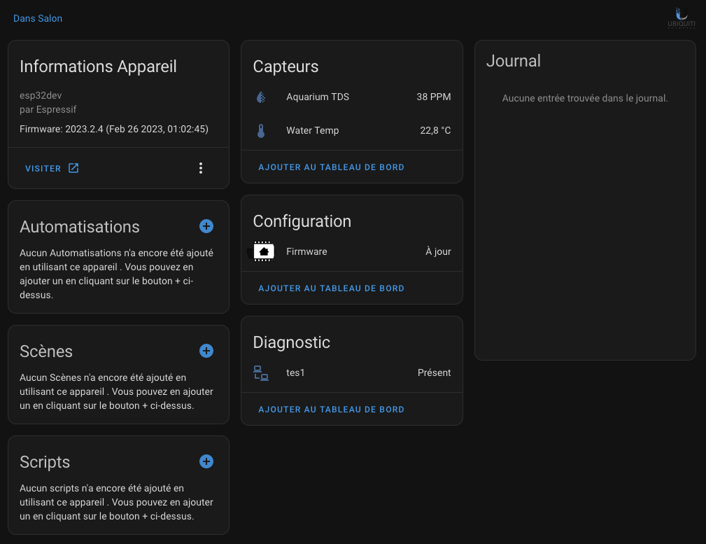
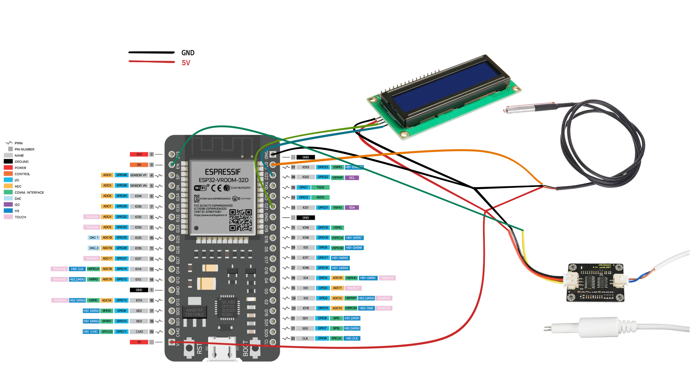

# DOMORIUM

## C'est quoi ?
Domorium est un projet open source qui permettra a n'importe qui d'ajouter une touche de technologie pour son aquarium.

Le but de Domorium est de pouvoir consulter en temps réel comment se comporte votre aquarium et voir son évolution au fil du temps.

Domorium peut être installé avant ou après la mise en place d'un aquarium.
Si vous installez Domorium avant de mettre en place votre aquarium vous pourrez savoir a quel moment vous pouvez ajouter des poissons

## Ce qu'il vous faut
Pour mener à bien ce projet, je vais m'appuyer sur d'autres outils open source afin de ne pas avoir à tout réécrire

Dans un premier temps, il vous faudra installer et configurer 
[Home Assistant](https://home-assistant.io/)
Puis, il faudra installer [ESPHome](https://esphome.io/). [Documentation](https://esphome.io/guides/getting_started_hassio.html)

Ensuite, nous créerons trois objets connectés, voici la liste de course :
- 1 ESP32 - [Lien](https://www.amazon.fr/gp/product/B07Z83H831/ref=ewc_pr_img_1?smid=A1X7QLRQH87QA3&psc=1)
- 1 capteur TDS (Total Dissolved Solids) - [Lien](https://www.amazon.fr/gp/product/B08KXRHK7H/ref=ewc_pr_img_3?smid=A22SB6W8K59090&psc=1)
- 1 capteur de pH - [Lien](https://www.amazon.fr/gp/product/B081QK9TX2/ref=ewc_pr_img_2?smid=A2KRFTGU6PBCQ4&psc=1)
- 1 capteur de température - [Lien](https://www.amazon.fr/gp/product/B01MZG48OE/ref=ewc_pr_img_1?smid=A1X7QLRQH87QA3&psc=1)
- 1 ecran LCD 16x2

## PROTOTYPE :
Voici une photo du montage d'exemple afin de faire fonctionner l'ESP32 ainsi que pour le moment les capteurs de température et des TDS

Voici ce qu'Home Assistant me retourne comme valeurs

Voici un "schéma" du câblage (j'ai fait du mieux que j'ai pu) :

Le code se trouve dans le repo :)

